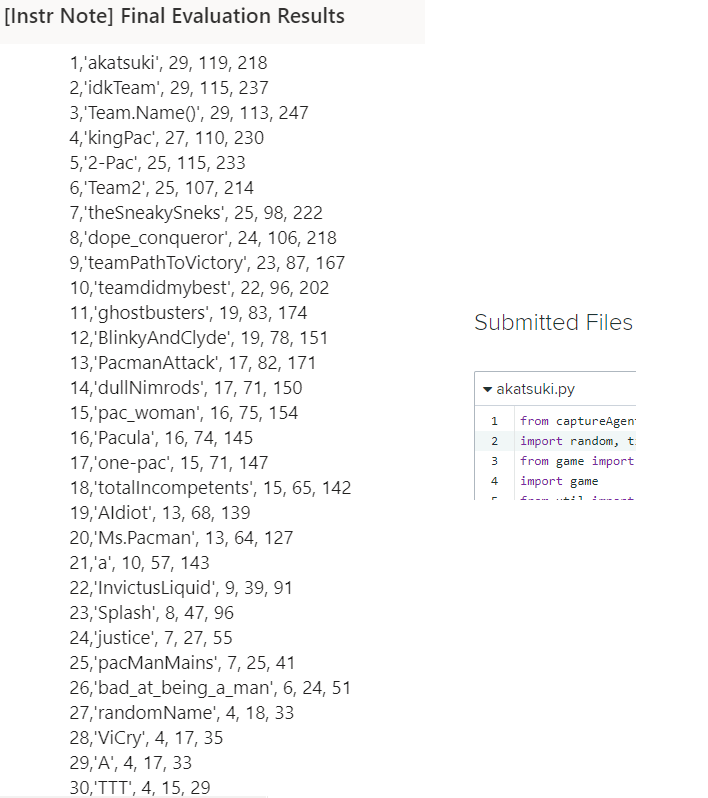

# Artificial Intelligence Capture the Flag
Capture the flag AI contest ~ http://ai.berkeley.edu/contest.html 
Our Agent: *akatsuki3.py* 
UC Berkeley Test Agent: *baselineTeam.py* 
**Our agent beats the test agent 100/100 games, although sometimes tieing on certain maps.** 

# Contest Results

# Playing the Game (Requires Python 2.7)
 python capture.py -b baselineTeam.py -r akatsuki3.py
